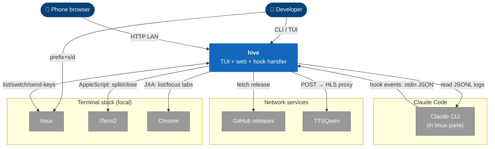
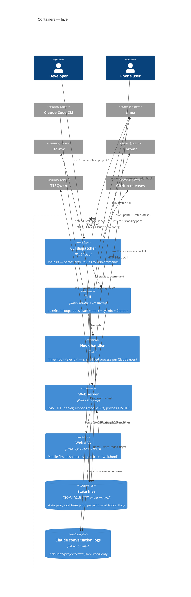
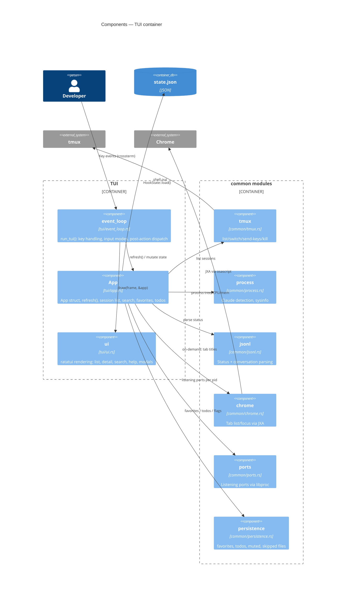
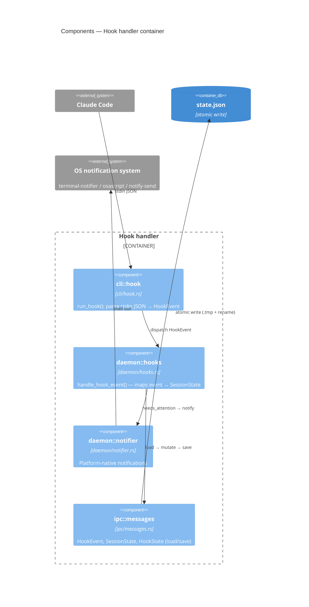

# Architecture

C4 model diagrams for hive. Rendered by GitHub via Mermaid.

## Level 1 — System Context

Who and what hive interacts with.

A high-level view. Mermaid's C4 auto-layout is rough — read top to bottom: people on top, hive in the middle, externals grouped below.



## Level 2 — Containers

The processes/binaries that make up hive and how they share state.



## Level 3 — Components

Zoomed in on the two most interesting containers.

### TUI container



### Hook handler container



## Level 4 — Code

The shared IPC data model — the contract between the hook handler (writer) and TUI/web (readers). Defined in `ipc/messages.rs`.

```mermaid
classDiagram
    class HookState {
        +HashMap~String, SessionState~ sessions
        +load() HookState
        +save() Result
        +cleanup_stale(threshold)
    }

    class SessionState {
        +String session_id
        +String cwd
        +SessionStatus status
        +bool needs_attention
        +Option~String~ last_activity
    }

    class SessionStatus {
        <<enumeration>>
        Waiting
        NeedsPermission
        EditApproval
        PlanReview
        QuestionAsked
        Working
        Unknown
    }

    class HookEvent {
        <<enumeration>>
        Stop
        PreToolUse
        PostToolUse
        PermissionRequest
        UserPromptSubmit
        Notification
        +session_id() str
        +cwd() str
    }

    class NeedsPermission {
        +String tool_name
        +Option~String~ description
    }

    class EditApproval {
        +String filename
    }

    HookState "1" *-- "many" SessionState : sessions
    SessionState --> SessionStatus : status
    SessionStatus <|-- NeedsPermission
    SessionStatus <|-- EditApproval
    HookEvent ..> SessionState : updates via daemon::hooks
```

## Notes

- **No daemon**: every container is short-lived (CLI, hook) or user-launched (TUI, web). Coordination is via file system only.
- **State writes** are atomic (write `.tmp`, rename) so concurrent hook events never corrupt `state.json`.
- **Read-only externals**: Claude's JSONL logs are never modified — hive only parses them for status and conversation rendering.
- **Code-level (C4 L4)** is shown only for the IPC types — they're the cross-container contract. Other modules are well-covered by the source itself + the module map in `CLAUDE.md`.
